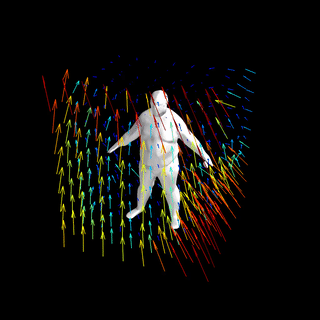
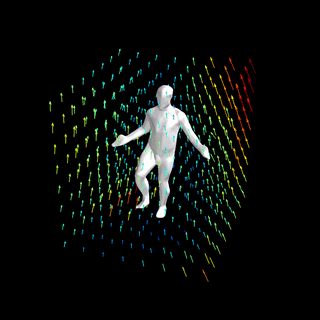
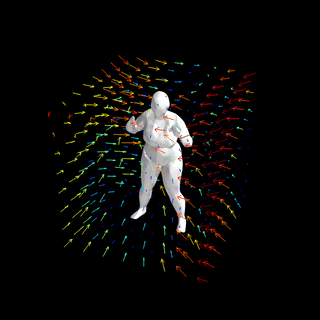
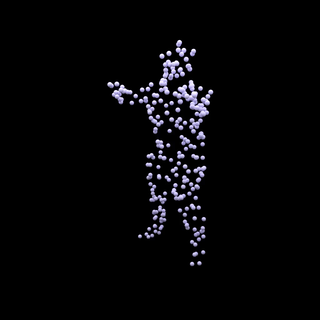
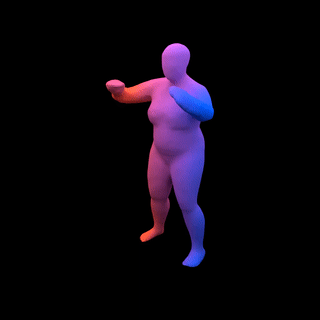
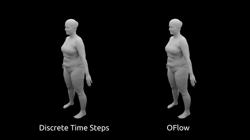
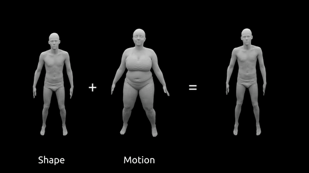

# Occupancy Flow 
<div style="text-align: center">



</div>

This repository contains the code for the project [Occupancy Flow - 4D Reconstruction by Learning Particle Dynamics](https://avg.is.tuebingen.mpg.de/publications/niemeyer2019iccv).

You can find detailed usage instructions for training your own models and using pre-trained models below.

If you find our code or paper useful, please consider citing

    @inproceedings{OccupancyFlow,
        title = {Occupancy Flow: 4D Reconstruction by Learning Particle Dynamics},
        author = {Niemeyer, Michael and Mescheder, Lars and Oechsle, Michael and Geiger, Andreas},
        booktitle = {Proc. of the IEEE International Conf. on Computer Vision (ICCV)},
        year = {2019}
    }

## Installation
### Set up the environment
#### method 1: local install
First you have to make sure that you have all dependencies in place. The simplest way to do so, is to use [anaconda](https://www.anaconda.com/).

You can create and activate an anaconda environment called `oflow` using

```
conda env create -f environment.yaml
conda activate oflow
```

#### method 2: using docker
Run below command. It will set up everything and share the output with host machine.
```
docker compose build
docker compose run app bash
(or in case you have cuda11 compatible gpu) docker compose run cuda11app bash
```

### Set up Occupancy Flow 
Next, compile the extension modules. You can do this via
```
python setup.py build_ext --inplace
```

## Demo

You can test our code on the provided input point cloud sequences in the `demo/` folder. To this end, simple run
```
python generate.py configs/demo.yaml
```
This script should create a folder `out/demo/` where the output is stored.

## Dataset

### Point-based Data
To train a new model from scratch, you have to download the full dataset.
You can download the pre-processed data (~42 GB) using

```
bash scripts/download_data.sh
```

The script will download the point-based point-based data for the [Dynamic FAUST (D-FAUST)](http://dfaust.is.tue.mpg.de/) dataset to the `data/` folder. 

_Please note_: We do not provide the renderings for the 4D reconstruction from image sequences experiment nor the meshes for the interpolation and generative tasks due to privacy regulations. We outline how you can download the mesh data in the following.

### Mesh Data

Please follow the instructions on [D-FAUST homepage](http://dfaust.is.tue.mpg.de/) to download the "female and male registrations" as well as "scripts to load / parse the data".
Next, follow their instructions in the `scripts/README.txt` file to extract the obj-files of the sequences. Once completed, you should have a folder with the following structure:   
___
your_dfaust_folder/  
| 50002_chicken_wings/  
&nbsp;&nbsp;&nbsp;&nbsp;| 00000.obj  
&nbsp;&nbsp;&nbsp;&nbsp;| 00001.obj  
&nbsp;&nbsp;&nbsp;&nbsp;| ...  
&nbsp;&nbsp;&nbsp;&nbsp;| 000215.obj  
| 50002_hips/  
&nbsp;&nbsp;&nbsp;&nbsp;| 00000.obj  
&nbsp;&nbsp;&nbsp;&nbsp;| ...  
| ...  
| 50027_shake_shoulders/  
&nbsp;&nbsp;&nbsp;&nbsp;| 00000.obj  
&nbsp;&nbsp;&nbsp;&nbsp;| ...  
___
You can now run
```
bash scripts/migrate_dfaust.sh path/to/your_dfaust_folder
```
to copy the mesh data to the dataset folder. 
The argument has to be the folder to which you have extracted the mesh data (the `your_dfaust_folder` from the directory tree above).

## Usage

When you have installed all dependencies and obtained the preprocessed data, you are ready to run our pre-trained models and train new models from scratch.

### Generation

<div style="text-align: center">


</div>

To start the normal mesh generation process using a trained model, use

```
python generate.py configs/CONFIG.yaml
```
where you replace `CONFIG.yaml` with the name of the configuration file you want to use.

The easiest way is to use a pretrained model. You can do this by using one of the config files

```
configs/pointcloud/oflow_w_correspond_pretrained.yaml
configs/interpolation/oflow_pretrained.yaml
configs/generative/oflow_pretrained.yaml
```

Our script will automatically download the model checkpoints and run the generation. 
You can find the outputs in the `out/` folder.

Please note that the config files *_pretrained.yaml are only for generation, not for training new models: when these configs are used for training, the model will be trained from scratch, but during inference our code will still use the pretrained model.

### Generation - Generative Tasks

<div style="text-align: center">


</div>

For model-specific latent space interpolations and motion transfers, you first have to run
```
python encode_latent_motion_space.py config/generative/CONFIG.yaml
```
Next, you can call 
```
python generate_latent_space_interpolation.py config/generative/CONFIG.yaml
``` 
or 
```
python generate_motion_transfer.py config/generative/CONFIG.yaml
```

*Please note*: Make sure that you use the appropriate model for the generation processes, e.g. the latent space interpolations and motion transfers can only be generated with a generative model (e.g. `configs/generative/oflow_pretrained.yaml`).

### Evaluation
You can evaluate the generated output of a model on the test set using

```
python eval.py configs/CONFIG.yaml
```
The evaluation results will be saved to pickle and csv files.

### Training

Finally, to train a new network from scratch, run
```
python train.py configs/CONFIG.yaml
```
You can monitor the training process on http://localhost:6006 using tensorboard:
```
cd OUTPUT_DIR
tensorboard --logdir ./logs --port 6006
```
where you replace `OUTPUT_DIR` with the respective output directory. For available training options, please have a look at `config/default.yaml`. 


## Further Information

### Implicit Representations
If you like the Occupancy Flow project, please check out our similar projects on inferring [3D shapes (Occupancy Networks)](https://avg.is.tuebingen.mpg.de/publications/occupancy-networks) and [texture (Texture Fields)](https://avg.is.tuebingen.mpg.de/publications/oechsle2019iccv).

### Neural Ordinary  Differential Equations
If you enjoyed our approach using differential equations, checkout Ricky Chen et. al.'s awesome implementation of [differentiable ODE solvers](https://github.com/rtqichen/torchdiffeq) which we used in our project.

### Dynamic FAUST Dataset
We applied our method to the cool [Dynamic FAUST](http://dfaust.is.tue.mpg.de/) dataset which contains sequences of real humans performing various actions.